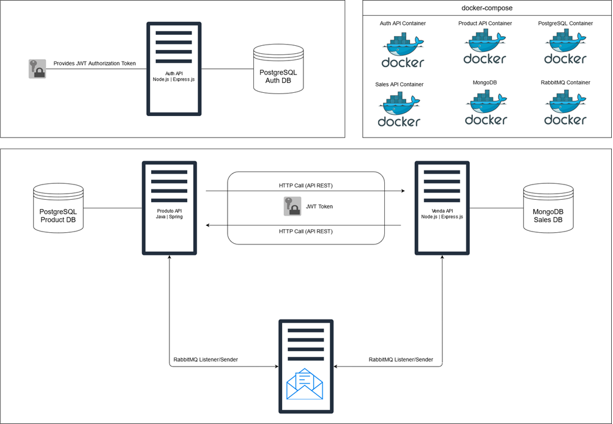

<h1 align="center"> 💻💬 Comunicação entre microsserviços 💻💬 </h1>

## Descrição

Repositório destinado a armazenar os projetos implementados durante o curso "Comunicação entre microsserviços".

***

## Sobre

Os projetos apresentados neste repositório tem como intuito a construção e aprendizado de uma comunicação entre APIs e para tal foram implementados e utilizados 7 conteiners do serviço Docker:
- **APIs**
    - **auth-api**: criado em node.js, utilizado para realizar a autenticação via token de um usuário e também a autorização via header de uma requisição.
    - **product-api**: criado em Spring Boot, implementado para a inserção, autualização e deleção de produtos.
    - **sales-api**: criado em node.js, utilizado para inserção, autualização e deleção de compras.
- **Serviços**
    - **auth-db**: banco de dados implementados com PostgreSQL, para armazenar os dados dos usuários.
    - **product-db**: banco de dados implementados com PostgreSQL, para armazenar os dados dos produtos.
    - **sales-db**: banco de dados implementados com MongoDB, para armazenar os dados das vendas.
    - **sales-rabbit**: conteiner responsável por subir o serviço de mensageria, RabbitMQ.

Cada transação realizada entre os microsserviços apresenta rastreabilidade com ***transactionId*** e ***serviceId***.

***

## Tecnologias, conteúdos e bibliotecas abordados/usadao para a implementação

- Java 17
- Spring Boot 3
- Javascript ES6
- Node.js
- ES6 Modules
- Express.js
- MongoDB 
- API REST
- PostgreSQL
- RabbitMQ
- Docker
- docker-compose
- JWT
- Spring Cloud OpenFeign
- Axios

***

## Estrutura

! Imagem criado pelo autor do curso <a href="https://github.com/vhnegrisoli">vhnegrisoli</a> !

***

## Link do curso

<a href="https://www.udemy.com/course/comunicacao-entre-microsservicos">CURSO</a>

***

## Status

✅ FINALIZADO ✅

***

## Autor

Feito por Bruno Jun Amanai Yamada.

 
